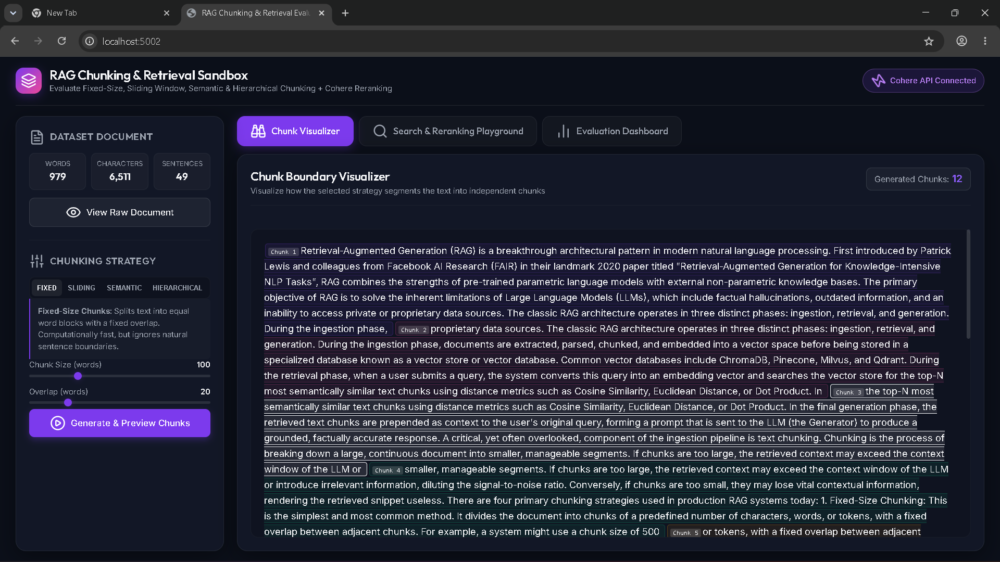

# Day 12: RAG Chunking Strategies & Cohere Reranker Evaluation Sandbox

This project is an interactive sandbox and evaluation suite designed to test, visualize, and measure the performance of **four distinct text chunking strategies** for Retrieval-Augmented Generation (RAG) systems. It also explores the impact of **second-pass retrieval** using a cross-encoder model (**Cohere Rerank**).

---

## 🚀 Quick Start Instructions

Follow these simple steps to run the evaluation CLI or launch the interactive visual playground:

### 1. Install Dependencies
Ensure you have Node.js (v18+) installed. Run the following command inside the `Day-12` folder:
```bash
npm install
```

### 2. Verify Environment Variables
Create or verify the `.env` file in the `Day-12` directory. It should contain your Cohere Trial API key:
```env
COHERE_API_KEY=cohere_AqJKAc119huqnRaq7Hiw6oBPVUD4v4VfFvH49gZo1aYcIk
PORT=5002
```

### 3. Run the CLI Evaluation
To run the automated evaluation suite across the 10 queries, compute Hit Rate and MRR, and generate the comparative markdown report, run:
```bash
npm start
```
*Note: Due to Cohere's Trial Key rate limits (10 requests per minute), the script incorporates a 6.5-second spacing between requests. The evaluation will take approximately 4 minutes to run and will automatically write the results to `chunking_comparison_report.md`.*

### 4. Launch the Interactive Web Dashboard
To visually play with the chunking boundaries, search the vector index, and see reranking promotions in real-time, start the local server:
```bash
npm run dev
```
Then, open your browser and navigate to:
```
http://localhost:5002
```

---

## 🔍 Visualizing the Chunking Strategies

This project implements and tests four primary chunking methodologies on the same dataset (`dataset/document.txt`):

1. **Fixed-Size Chunking (Word-Based)**: Splits text into blocks of a fixed word count (e.g., 100 words) with a small overlap (e.g., 20 words). It is simple and fast but often cuts sentences in half, breaking semantic flow.
2. **Sliding Window Chunking**: A variation of fixed-size chunking with a larger window size (e.g., 150 words) and higher overlap (e.g., 100 words), ensuring that context is captured in multiple redundant views.
3. **Semantic Chunking**: Splits text into sentences, gets embeddings for each sentence, and groups them by computing cosine similarities between consecutive sentences. Boundaries are placed where similarity falls below a percentile threshold (e.g., 25th percentile). This produces cohesive chunks representing a single topic.
4. **Hierarchical Chunking (Parent-Child)**: Splits the document into large parent chunks (e.g., 250 words) and smaller child chunks (e.g., 60 words). We embed and search against the small child chunks for retrieval precision, but return the larger parent chunk to provide the LLM with full context.

---

## 🧠 Cohere Rerank: Second-Pass Retrieval

First-pass vector retrieval (using bi-encoders) is fast but computes query and document embeddings independently, missing fine-grained relevancy. 

To solve this, we implement **second-pass retrieval** using **Cohere Rerank** (`rerank-english-v3.0`):
* **First Pass**: In-memory cosine similarity search returns the top 5 candidates.
* **Second Pass**: The query and the top 5 candidates are sent to Cohere's cross-encoder. It evaluates the query-document text interactions together using self-attention and assigns a relevance score.
* **Result**: We keep the top 3 reranked chunks. This shifts the most relevant chunks to Rank 1 (improving **Mean Reciprocal Rank - MRR**) and recovers missed items (improving **Hit Rate**).

---

## 📂 Project Structure

```
Day-12/
├── dataset/
│   ├── document.txt                   # Long-form guide on RAG (testing document)
│   ├── queries.json                   # 10 test queries and ground-truth passages
│   └── eval_results.json              # Cached evaluation results
├── utils/
│   ├── cohere.js                      # Cohere API client (embeddings, rerank, retry backoff)
│   └── vectorUtils.js                 # Pure JS cosine similarity & retrieval helpers
├── chunkers.js                        # Implementation of the 4 chunkers
├── evaluator.js                       # Execution engine of the 10-query test suite
├── index.js                           # CLI entry point (runs eval and writes report)
├── server.js                          # Express server for the Web Dashboard
├── public/                            # Web Dashboard assets (HTML, CSS, JS)
│   ├── index.html
│   ├── style.css
│   └── app.js
├── chunking_comparison_report.md      # Auto-generated markdown report
├── package.json
└── README.md                          # Run instructions and project details
```
