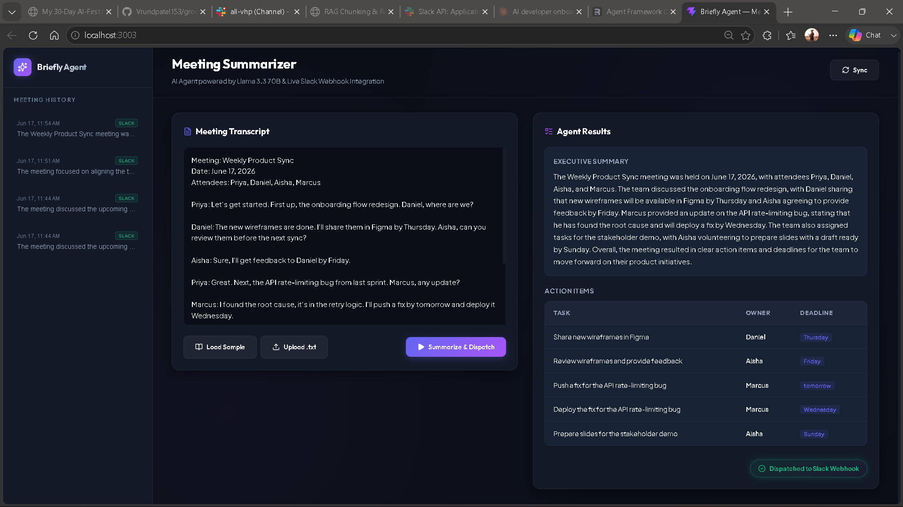
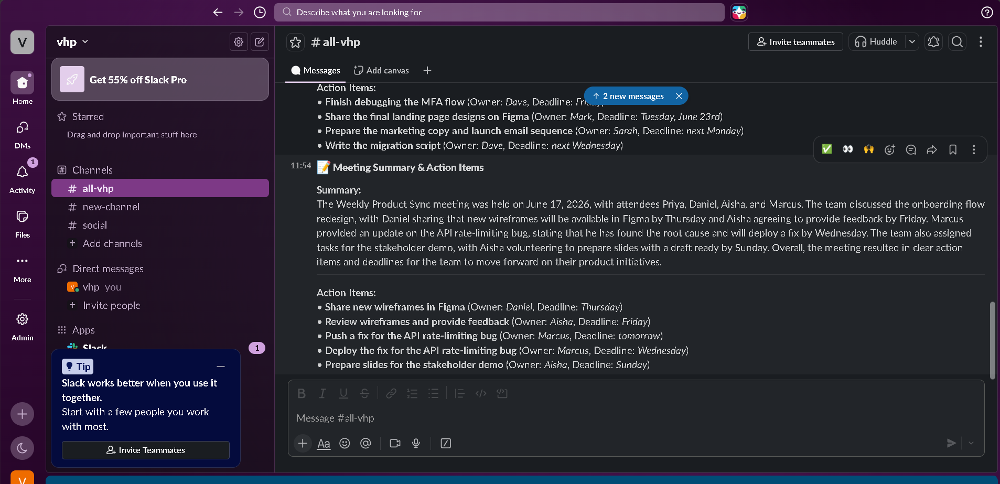

# Day 15: Meeting Summarizer Agent

[📺 Watch the Demonstration Video](./meeting%20summary.mp4)


A Node.js and React application that acts as an autonomous meeting summarization and dispatch agent. Powered by the Llama-3.3-70b-versatile model on Groq, the agent generates concise summaries, extracts structured action items with assigned owners and deadlines, sends them to a Slack channel via webhook, and persists records in a local JSON database.


## Architecture & Flow

1. **User Input**: Paste or load a meeting transcript into the React frontend.
2. **Analysis**: The Express backend prompts Groq to generate a concise 3–5 sentence executive summary.
3. **Action Extraction**: The `extract_action_items` tool runs on the transcript to extract structured objects containing `{ task, owner, deadline }` using Groq's JSON mode.
4. **Slack Dispatch**: The `send_to_slack` tool formats the summary and action items and sends a rich markdown card to a designated Slack channel.
5. **Persistence**: The record is saved to a local JSON database file (`db.json`) and instantly updated in the frontend history sidebar.

---

## Setup & Installation

### 1. Configure Environment Variables
In the project directory `Day-15`, configure the `.env` file containing:

```env
GROQ_API_KEY=your_groq_api_key
SLACK_WEBHOOK_URL=your_slack_webhook_url
```

* **GROQ_API_KEY**: Get yours from the [Groq Console](https://console.groq.com/).
* **SLACK_WEBHOOK_URL**: Create an Incoming Webhook for your Slack workspace by following the [Slack Webhooks Guide](https://api.slack.com/messaging/webhooks).

---

### 2. Install and Start the Backend
Navigate to the `backend` folder, install dependencies, and start the server:

```bash
cd backend
npm install
npm start
```
The backend server will run on [http://localhost:5000](http://localhost:5000).

---

### 3. Install and Start the Frontend
In a new terminal window, navigate to the `frontend` folder, install dependencies, and start the development server:

```bash
cd frontend
npm install
npm run dev
```
Open [http://localhost:3003](http://localhost:3003) in your browser to view the application.

---

## Technical Details

* **Backend**: Express.js (Node.js) with native ES Modules, Groq SDK, and direct file system database (`db.js`).
* **Frontend**: React (Vite) with Lucide Icons and custom-crafted CSS styling (zero external CSS frameworks for maximum fidelity).
