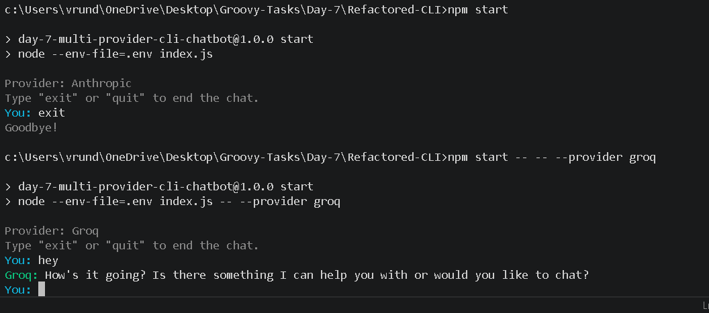

# Day 7 - Multi-Provider CLI Chatbot

A minimal multi-turn Node.js CLI chatbot with Anthropic, OpenAI, and Groq providers.



## Setup

Install dependencies:

```bash
npm install
```

Create a `.env` file:

```bash
ANTHROPIC_API_KEY=your_key_here
OPENAI_API_KEY=your_key_here
GROQ_API_KEY=your_key_here
```

Start the chatbot:

```bash
npm start
```

Choose a provider:

```bash
npm start -- -- --provider anthropic
npm start -- -- --provider openai
npm start -- -- --provider groq
```

Type your message after `You:`.

Type `exit` or `quit` to stop the chatbot.

The CLI colors message types: user prompts are cyan, assistant replies are green, errors are red, and status text is gray.
