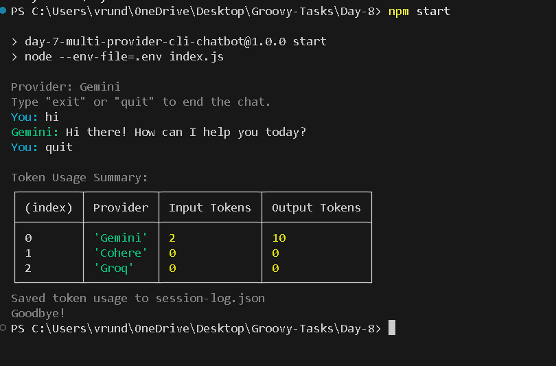

# Day 8 - Multi-Provider CLI Chatbot v2

A robust multi-turn Node.js CLI chatbot that integrates with Groq, Gemini, and Cohere providers. It features real-time token streaming, exponential backoff retries, and token usage reporting.


## Features

- **Streaming**: Native token-by-token streaming response display.
- **Retry & Backoff**: Automatic retry up to 4 times with exponential backoff (`1s`, `2s`, `4s`, `8s` + jitter) for `429` (rate limit), `5xx` (server errors), and timeouts.
- **Token Counting**: Tracks input and output tokens consumed per session, displays a summary table on exit, and logs data to `session-log.json`.

## Setup

Install dependencies:

```bash
npm install
```

Create a `.env` file:

```env
GROQ_API_KEY=your_groq_key_here
GEMINI_API_KEY=your_gemini_key_here
COHERE_API_KEY=your_cohere_key_here
```

## Running the Chatbot

Start the chatbot with your chosen provider:

```bash
# Gemini (Default)
npm start

# Cohere
npm start -- -- --provider cohere

# Groq
npm start -- -- --provider groq
```

Type `exit` or `quit` to stop the chatbot.

## Testing Rate Limits & Exponential Backoff

To verify the error handling and exponential backoff retry logic, you can temporarily simulate rate limits or timeouts in the code:

1. **Trigger a rate limit error (429)**:
   Add a temporary mock call at the start of a provider's chat function (e.g., `chatWithGroq`) that throws a `429` error:
   ```javascript
   let callCount = 0; // place outside the function
   // Inside the withRetry wrapper:
   if (callCount < 2) {
     callCount++;
     const err = new Error("Rate limit exceeded");
     err.status = 429;
     throw err;
   }
   ```
   You will see the retry attempt logged with its backoff delays, after which it successfully completes the actual API call on the third attempt.

2. **Trigger a network timeout**:
   Throw an error with `.code === 'ETIMEDOUT'` or `.name === 'TimeoutError'`:
   ```javascript
   const err = new Error("Connection timeout");
   err.code = "ETIMEDOUT";
   throw err;
   ```
