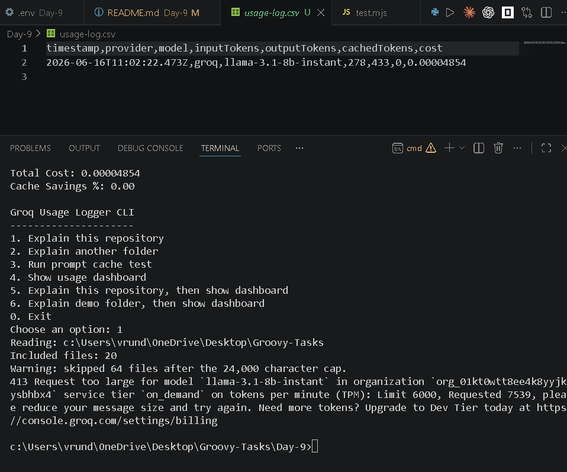

# Day-9: Groq Usage Logger CLI

Node.js CLI scripts that use the Groq OpenAI-compatible API.

<video controls src="20260616-1102-03.8102190.mp4" title="Title"></video>
Default model: `openai/gpt-oss-20b`.

Cheap quick-test model: `llama-3.1-8b-instant`.

The easiest path is:

```powershell
npm install
npm start
```

## Files

- `cache-test.js` - makes exactly two sequential Groq calls with the same long prompt prefix and prints usage, cached-token fields, and cost difference.
- `explain-codebase.js` - accepts a folder path, reads code files up to about 24K characters by default, and asks Groq to explain the codebase structure.
- `usage-logger.js` - shared CSV logger that appends usage rows to `usage-log.csv`.
- `dashboard.js` - reads `usage-log.csv` and prints total calls, tokens, cost, and cache savings percentage.
- `index.js` - interactive menu for explaining a folder, running the cache test, and viewing the dashboard.
- `demo-codebase/` - tiny folder for safe manual testing.

## Setup

Install dependencies:

```powershell
npm install
```

Add your Groq key to `.env`:

```env
GROQ_API_KEY=your_groq_api_key
```

Optional: switch to the cheaper quick-test model in `.env`:

```env
GROQ_MODEL=llama-3.1-8b-instant
```

Optional: lower or raise the code read cap:

```env
CODEBASE_MAX_CHARS=12000
```

You can also set it in PowerShell:

```powershell
$env:GROQ_API_KEY="your_groq_api_key"
```

## Test

Run syntax checks without making API calls:

```powershell
npm test
```

Confirm the missing-key guard exits cleanly:

```powershell
node cache-test.js
node explain-codebase.js .
```

## Run

Start the interactive CLI:

```powershell
npm start
```

Useful menu choices:

- `1` explains this repository.
- `2` asks for a folder path and explains that folder.
- `3` runs the two-call prompt cache test.
- `4` shows the CSV usage dashboard.
- `5` explains this repository, then shows the updated dashboard.
- `6` explains the small demo folder, then shows the updated dashboard.

Direct commands still work:

```powershell
npm run cache
npm run explain
npm run demo
npm run dashboard
```
